# Intro to React.js

---


---

## Learning Objectives

* Explain what ReactJS is.
* Explain the component model of web development.
* Create and render React components in the browser.
* Pass in data to a React component via `props`.
* Nest React components.
* Modify the `state` of a React component through events.

---

## Framing (5 minutes / 0:05)

### What is ReactJS?

React is a library used to craft modern day UI and create views for the front-end in web, client and native applications.

> **Selling Point:** By modeling small compatible components that focus on just rendering a view, we as developers can move business logic out of the DOM, and therefore improve our app's performance, maintainability, modularity, and readability.

#### Some History

The first thing most people hear about React is "Facebook uses it."
* First used by Facebook in 2011. Then Instagram in 2012.
* Went open source in May 2013.

React was born out of Facebook's frustration with the traditional MVC model and how...
  * Re-rendering something meant re-rendering everything (or just a lot).
  * That had negative implications on processing power and ultimately user experience, which at times became glitchy and laggy.

> If you want to get a taste of what React's all about, [here's an introduction from React.js Conf 2015.](https://www.youtube.com/watch?v=KVZ-P-ZI6W4&feature=youtu.be&t=510)  

### React in MVC

**React can be thought of as the "Views" layer.**

<details>
  <summary>What is the role of a "view" in a front-end Javascript application?</summary>

  > The visual template the user sees, populated with data from our models -- not the entire page.

</details>

React can be used agnostically throughout your stack. It's role is just to use data to render a UI.
* This means that React can also coexist with other Javascript frameworks. Let them handle the models and controllers, and have React sort out the views.

---

## Initial Setup (20 minutes / 0:25)

> **NOTE:** We're about to do a good amount of setup here. Don't worry if you fall behind - we will set aside time at the end of this section to get everybody caught up.  

In today's class we will be building a simple blog from scratch. By the end of the lesson, it will have one post with several comments.

> If you're interested, the solution and commit history for the blog can be found [here](https://github.com/ga-wdi-exercises/simple-react-blog/commits/solution).

Let's start by creating a directory for the app and initializing `npm`...


> `npm init -y` accepts all the defaults that, without the flag, you would have to hit the return key to accept.

Now, we're going to install **A LOT** of stuff. Bear with us for a second and run the following command in the terminal...

```bash
$ npm install --save react react-dom && npm install --save-dev html-webpack-plugin webpack webpack-dev-server babel-{core,loader} babel-preset-react
```

You'll know installation went okay if your `package.json` file looks like something like this. You might have different versions...

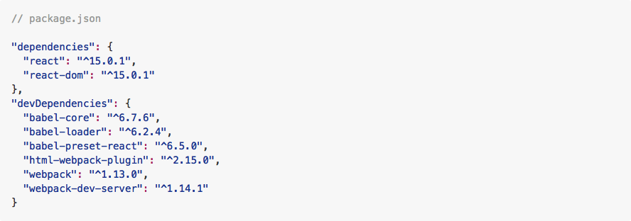

Let's take a look at the dependencies we just installed...
* **React:** The library itself.
* **React-DOM:** An additional module that allows us to update the DOM using React components.
* **Webpack:** You learned about this "code bundler" in your [Build Tools lesson](https://github.com/ga-wdi-lessons/build-tools#webpack-10-mins).
* **Babel:** This one's actually new. We'll be using Babel to transpile an HTML-like syntax called JSX into Javascript.

<details>
  <summary>What's the difference between `devDependencies` and `dependencies`?</summary>

  <br>

  ```
   DevDependencies are only used in the development environment.
  ```
</details>

<br>
Let's continue building out the app skeleton...

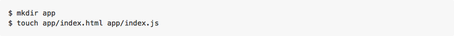

Inside our `index.html` file, let's add some boilerplate html...

​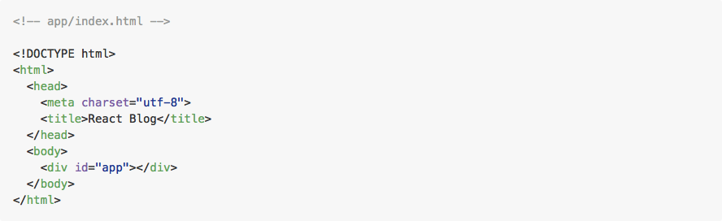

> Here we're creating a `div` with an id of `app`, which is the DOM element to which we'll be attaching our React application later on.

### Webpack
​
Now we need to setup up Webpack for our application so that we can bundle and serve our static assets.

<details>
<summary>Why do we need to bundle our code? What problem is Webpack solving? </summary>

```
Think about how many times we have to take our code and change it so it's compliant with what the browser is used to (vanilla HTML, CSS, and JavaScript). So where Webpack really shines is you're able to tell it every transformation your code needs to make, and it will do them and output a bundle file for you full of those changes (and some other helpful things as well like minification if you desire).
```

</details>

<br>
​
In your terminal run...

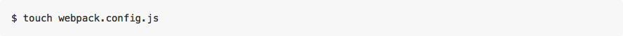
​
In that file, go ahead a define an initial object to export...
​
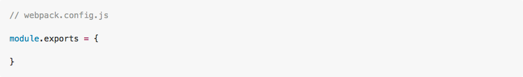

<details>
  <summary>What are 3 things we need to account for when defining our Webpack configuration?</summary>


   > (1) **`entry`**: The location of the app's root javascript file (specifying the app's point of entry).
   >
   > (2) **`output`**: Where we want the bundled up output to go.
   >
   > (3) **`loaders`**: The specific transformations to apply to our code.

</details>
​
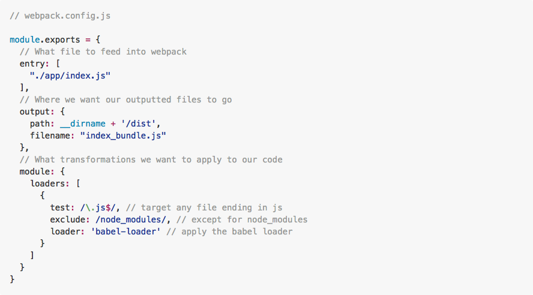

​Next we need to setup Babel to specify which transformations should be run by the loader. In our app's root directory, we need to create a babel configuration file...
​
<br>

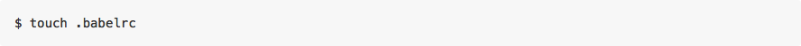
​
Inside `.babelrc`...
​


​Everything inside the `presets` array will be the specific transformations applied by Babel. For now, however, we are only adding the `react` preset, which will convert our JSX code into regular Javascript.  

Another thing we have to do is configure Webpack to produce an `html` file that loads our bundled code. At the top of `webpack.config.js`, let's utilize `html-webpack-plugin`...
​
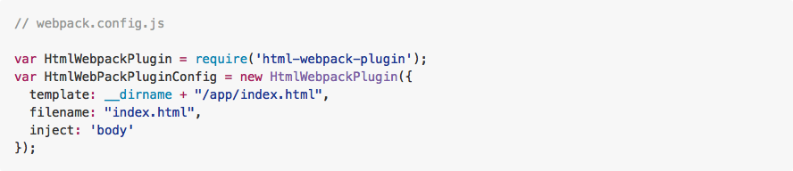

Now we can go ahead and add that as a plugin in our Webpack config...
​
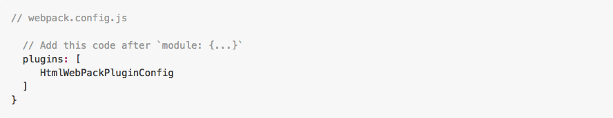

​We're using `html-webpack-plugin` to look into our `app/` directory and copy the contents of `index.html` there so that we can be sure to create another `index.html` in the `dist/` directory. This new `index.html` be the file that is loading in our bundled code and the one we will be serving our app from. Webpack will automatically sync the files after every change.

> `dist/` is the directory that will store all of our "bundled" code.​

In order to actually run Webpack, let's define a script in `package.json` to test our app's configuration...
​
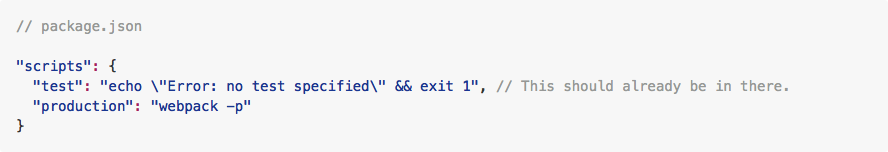

> There should already be a `scripts` object in `package.json`. Add this new key-value pair to that.

​Now from the command line, we can run a script that will launch Webpack and start the bundling...
​
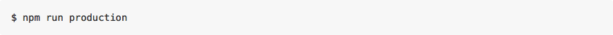

​If this command executes without any errors, it will create a new directory `dist`. In that directory, we will find...

* **`index_bundle.js`**: our app's minified Javascript code.
* **`index.html`**: a new index file that will link to `index_bundle.js`

One final thing: in order to actually run our code we'll need to spin a local server using `webpack-dev-server`. We can create a terminal command for this by adding another script to `package.json`...

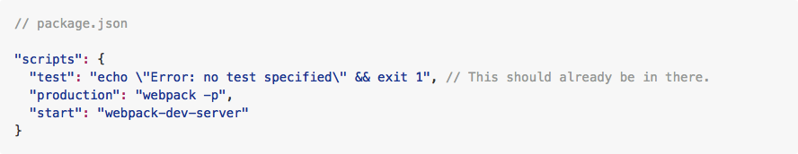

Now we can run `npm run start` from the Terminal and visit our application at `http://localhost:8080`.

---

### Stop / Catch Up

---

## Components

### You Do: Identifying Components (10 minutes / 0:35)

> 5 minutes exercise. 5 minutes review.

Break into pairs and take a look at CraigsList. Identify the visual "components" the website is comprised of. We suggest using markers to draw these out on your table! So something like this...


As you're drawing this out, think about the following questions...
* Where do you see "nested components"? Where do you not?
* Are there any components that share the same structure?
* Of these similar components, what is different about them?

Take a picture of your work and Slack it to the classroom channel before the exercise is over.

---

### I Do: Hello World - A Very Basic Component (10 minutes / 0:45)

> No need to follow along with this Hello World example. You will have the chance to implement this yourself when you get to the first Blog exercise.

The basic unit you'll be working with in ReactJS is a **component**.
* It sounds like a simple word, but using "components" is a pretty different way of approaching web development.
* Components can be thought of as functional elements that takes in data via `props` and a `state` -- more on those later -- and as a result produce a dynamic UI.

Throughout class we have separated HTML, CSS and Javascript.
* With components, the lines between those three become a bit blurry.
* Instead, we organize our web apps according to small, reusable components that define their own content, presentation and behavior.

What does a component look like? Let's start with a simple "Hello World" example...

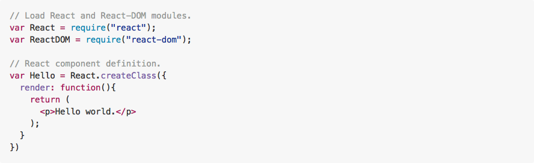

#### What's that HTML doing in my Javascript?

Often times we write out React components in **JSX**.
* JSX is an alternate Javascript syntax that allows us to write code that strongly resembles HTML. It is eventually transpiled to lightweight JavaScript objects.
* React then uses these objects to build out a "Virtual DOM" -- more on that in just a bit.

> React can be written without JSX. If you want to learn more, [check out this blog post](http://jamesknelson.com/learn-raw-react-no-jsx-flux-es6-webpack/).  

Let's break down the things we see here...

##### `var Hello`
This is the component we're creating. In this example, we are creating a "Hello" component.

##### `React.createClass`
This is the React library method we use to create our component definition.
  * Takes an object as an argument.

##### `render`
Every component has, at minimum, a render method. It generates a **Virtual DOM** node that will be added to the actual DOM.
* Looks just like a regular ol' DOM node, but it's not yet attached to the DOM.

**Virtual DOM? How is that different from the usual DOM?**

The Virtual DOM is a Javascript representation of the actual DOM.

* Because of that, React can keep track of changes in the actual DOM by comparing different instances of the Virtual DOM.
* React then isolates the changes between old and new instances of the Virtual DOM and then only updates the actual DOM with the necessary changes.
* By only making the "necessary changes," as opposed to re-rendering an entire view altogether, we save up on processing power.
* This is not unlike Git, with which you compare the difference -- or `diff` -- between two commits.


> If you're interested in learning more about the Virtual DOM, [check this video out](https://www.youtube.com/watch?v=-DX3vJiqxm4).

So we've created the template for our component. But how do we actually render it?

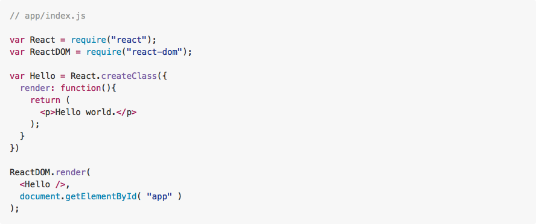

> In place of `ReactDOM.render` some tutorials will use React.renderComponent, which has been phased out. Change outlined [here](http://bit.ly/1E81Whs).

`ReactDOM.render` takes the Virtual DOM node created by `.createClass` and adds it to the actual DOM. It takes two arguments...
  1. The component.
  2. The DOM element we want to append it to.

What language is `<Hello />` written in? **JSX.**
* Similar to XML.
* When we say `<Hello />`, in plain Javascript we are actually saying `React.DOM.div( null, "Hello world.")`
  * Basically, a string of React methods that create a virtual DOM node.

> **NOTE:** Whenever you use a self-closing tag in JSX, you **MUST** end it with a `/` like `<Hello />` in the above example.

---

### Hello World: A Little Dynamic (10 minutes / 0:55)

Our `Hello` component isn't too helpful. Let's make it more interesting.
* Rather than simply display "Hello world", let's display a greeting to the user.
* So the question is, how do we feed a name to our `Hello` component without hardcoding it into our render method?

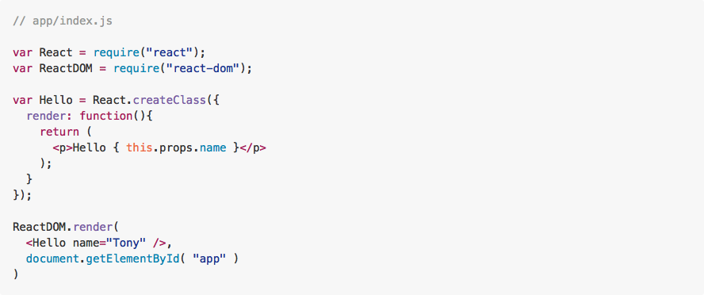

In the above example, we replaced "world" with `{this.props.name}`.

#### What are `.props`?

Properties! Every component has `.props`.
* Properties are immutable and cannot be changed while your program is running.
* We define properties in development and pass them in as attributes to the JSX element in our `.render` method.

We can create multiple properties for a component...

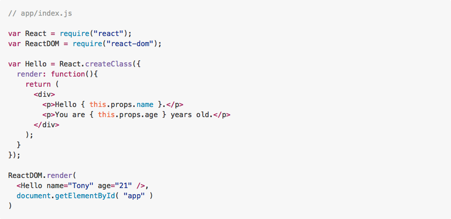

> **NOTE:** The return statement in `render` can only return one DOM element. You can, however, place multiple elements within a parent DOM element, like we do in the previous example with `<div>`.

---

## Break (10 minutes / 1:05)

---

### Exercise: A Blog Post (20 minutes / 1:25)

> 15 minutes exercise. 5 minutes review.

Let's have some practice creating a React component for scratch. How about a blog post?
* Create a `post` object literal in `index.js` that has the below properties.
  1. `title`
  2. `author`
  3. `body`
  4. `comments` (array of strings)
* Render these properties using a Post component.
* The HTML (or more accurately, JSX) composition of your Post is up to you.

#### [Solution](https://github.com/ga-wdi-exercises/simple-react-blog/commit/0e66a58ad0e34c273261a515ef4d71c8644b03d0)

---

### Nested Components (5 minutes / 1:30)

**Q:** What problems did you encounter when trying to add multiple comments to your Post?
* It would be a pain to have to explicitly define every comment inside of `<Post />`, especially if each comment itself had multiple properties.
* This problem is a tell tale sign that our separation of concerns is being stretched, and its time to break things into a new component.

We can nest Comment components within a Post component.
* We create these comments the same way we did with posts: `.createClass` and `.render`
* Then we can reference a comment using `<Comment />` inside of Post's render method.

A nested component looks something like this. You're going to take a stab at setting them up in the next exercise...

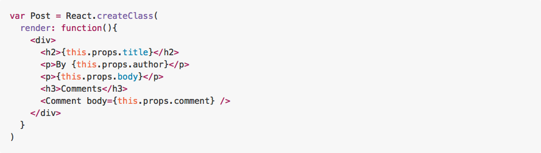

---

## Exercise: Add Nested Comments To Blog (15 minutes / 1:45)

> 10 minutes exercise. 5 minutes review.

1. Create a `Comment` component in the same way we did for `Post`. Its `render` method should render a `commentBody` property.
2. Amend your `Post`'s render method to include reference to a variable, `commentsList`, that is equal to the return value of generating multiple `<Comment />` elements. Make sure to pass in the `comment` body as an argument to each `Comment` component. Then render the `commentsList` some where inside the UI for a `Post`.

> **NOTE:** You can use `.map` in `Post`'s `render` method to avoid having to hard-code all your `Comment`'s. Read more about it [here](https://developer.mozilla.org/en-US/docs/Web/JavaScript/Reference/Global_Objects/Array/map) and [here](http://cryto.net/~joepie91/blog/2015/05/04/functional-programming-in-javascript-map-filter-reduce/).
>
> **HINT I:** You should only have to return one `<Comment />` inside of `.map`.
>
> **HINT II:** Remember that whenever you write vanilla Javascript inside of JSX, you need to surround it with single brackets (`{}`).

#### [Solution](https://github.com/ga-wdi-exercises/simple-react-blog/commit/2c50bb3fc124498e8576df3112508ca2ea4a78d1)

---

## Break (10 minutes / 1:55)

---

## State (10 minutes / 2:05)

So we know about React properties, and how they relate to our component's data.
* The thing is, `props` represent data that will be the same every time our component is rendered. What about data in our application that may change depending on user action?
* That's where `state` comes in...

Values stored in a component's state are mutable attributes.
* Like properties, we can access state values using `this.state.val`.
* Setting up and modifying state is not as straightforward as properties. It involves explicitly declaring the mutation, and then defining methods to define how to update our state....

Lets implement state in our earlier `Hello` example by incorporating a counter into our greeting.

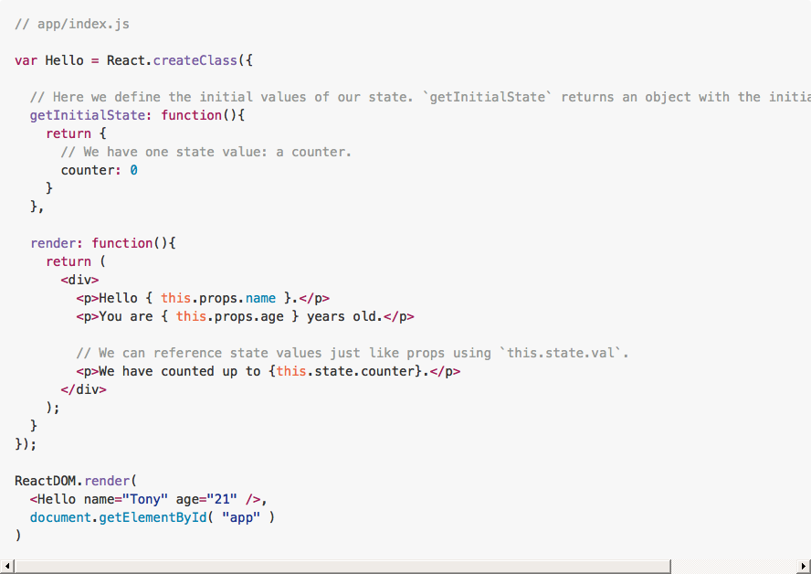

Ok, we set an initial state. But how do we go about changing it?
* We need to set up some sort of trigger event to change our counter.

<details>
  <summary>
    Let's do that via a button click event -- where should we initialize it?
  </summary>

  > In the return value of our Post's `render` method.

</details>

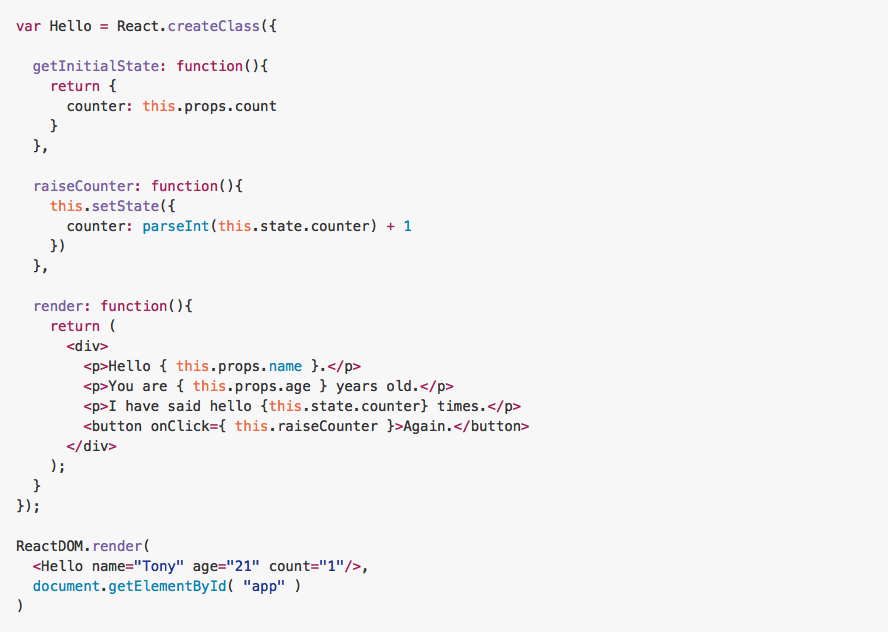

Whenever we run `.setState`, our component "diff's" the current DOM, and compares the Virtual DOM node with the updated state to the current DOM.
* Only replaces the current DOM with parts that have changed.
* This is super important! Using React, we only change parts of the DOM that need to be changed. This has strong implications on performance.

---

### Exercise: Implement State (20 minutes / 2:25)

> 15 minutes exercise. 5 minutes review.

Let's implement `state` in our Blog by making `body` a mutable value.

1. Initialize a state using `.getInitialState` for our `Post`. It should create a state value called `body`. Set it to the `body` of your hard-coded `post`.
2. Modify `Post`'s `render` method so that `body` comes from `state`, not `props`.
3. Create an `editPost` method inside `Post` that updates `body` based on a user input.
  * You should use `setState` somewhere in this method.
  * How can you get a user input? Keep it simple and start with `prompt`.
4. Add a button to `Post`'s `render` method that triggers `editPost`.

#### Bonus I

Use a form to take in user input. The post body should change `onSubmit`.

#### Bonus II

Make it so that the post body changes as you type it into the form. This will make use of `onChange`.

> **NOTE:** You're starting to mock Angular's two-way data binding!

#### [Solution](https://github.com/ga-wdi-exercises/simple-react-blog/commit/ff1c8d911bc03a2d8d0782dbd152594f8c8d5692)

---

## Closing (5 minutes / 2:30)

### What's Next?

* [Router](https://github.com/reactjs/react-router)
* [API/Axios](https://www.npmjs.com/package/axios)
* [Events](https://facebook.github.io/react/tips/dom-event-listeners.html)
* [Forms](https://facebook.github.io/react/docs/forms.html)

---

## Additional Reading

* [Tyler McGinnis' React.js Program](http://www.reactjsprogram.com/)
* [Raw React: No JSX, Webpack, ES6, etc.](http://jamesknelson.com/learn-raw-react-no-jsx-flux-es6-webpack/)
* [Integrating React with Backbone](https://blog.engineyard.com/2015/integrating-react-with-backbone)
* [React DC (Meetup)](http://www.meetup.com/React-DC/)
* [React Tic-Tac-Toe (by Jesse Shawl)](https://github.com/jshawl/react-tic-tac-toe)
